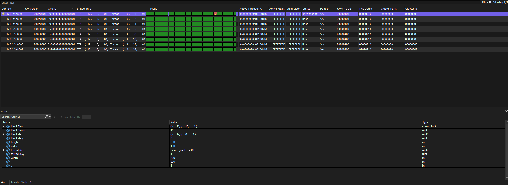
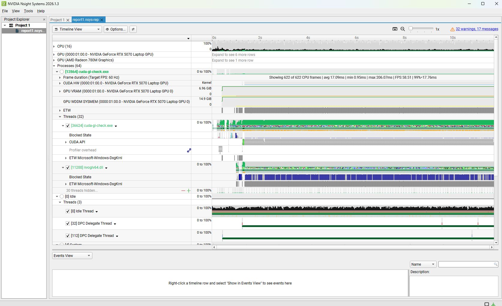
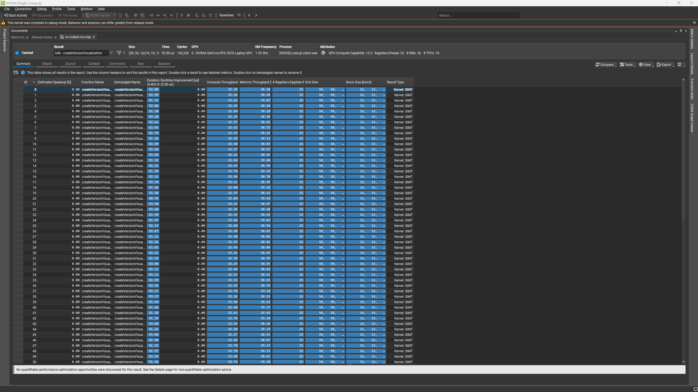
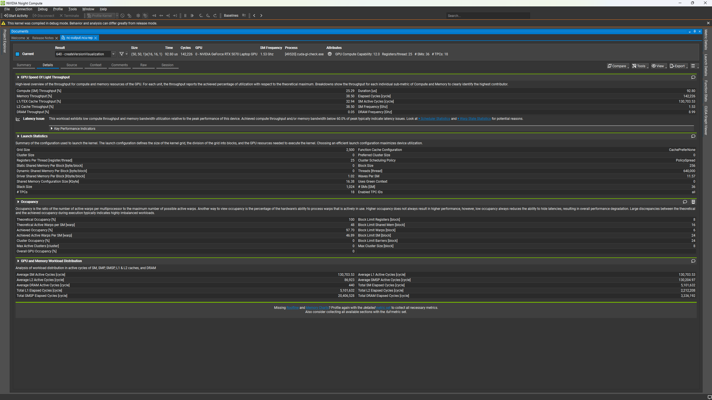
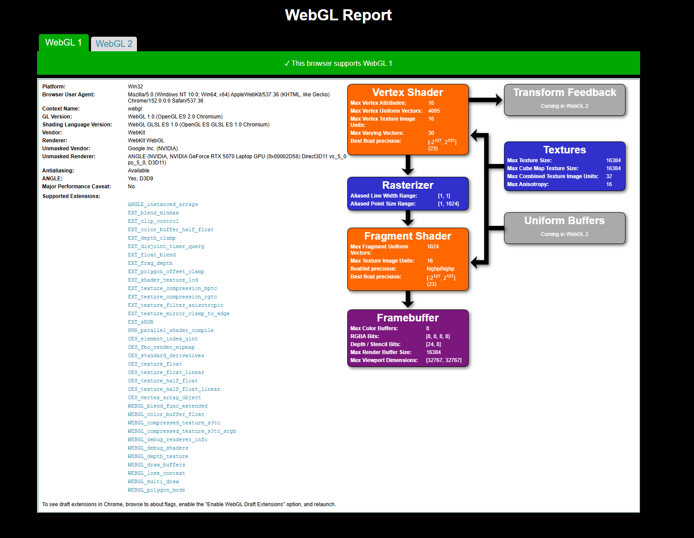

Project 0 Getting Started
====================

**University of Pennsylvania, CIS 5650: GPU Programming and Architecture, Project 0**

* Shanshan Wu
* Tested on: Windows 11, AMD Ryzen 9 270 @ ~4.0GHz,32GB RAM, NVIDIA GeForce RTX 5070 Laptop GPU (personal laptop)

### Part 2.1.2: Modify the CUDA Project and Take a Screenshot
 
   

### Part 2.1.3: Nsight Debugging

   

### Part 2.1.4: Nsight Systems

   

### Part 2.1.5: Nsight Compute

*Summary*

*Details*
   

### Part 2.2: Project Instructions - WebGL

